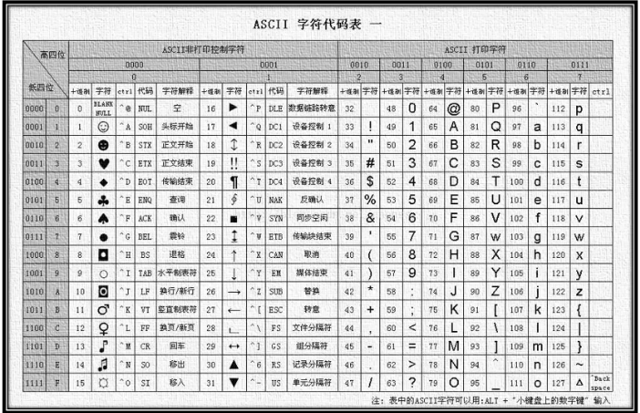

# 运算符
  - 赋值运算符
  - 一元运算符
  - 比较运算符
  - 逻辑运算符
  - 运算符优先级
## 1.1 赋值运算符
目标:能否使用赋值运算符简化代码
- 赋值运算符:对变量进行赋值的运算符
  - 已经学过的赋值运算符: = <font color=red>**将等号右边的值赋予给左边,要求左边必须是一个容器**</font>
  - 其他赋值运算符
    - +=
    - -= 
    - *=
    - /= 
    - %= 
- 使用这些运算符可以再对变量赋值时进行快速操作

## 1.2 一元运算符
目标:能够使用一元运算符做自增运算
众多的javaScript 的运算符可以根据所需表达式的个数,分为一元运算符、二元运算符、三元运算符

- 二元运算符 + - * / %
 - 例:
  let num = 10 + 20

- 一元运算符
- 例: 正负号 +1 -1

- 自增运算符号
++ --
使用场景:
  用于计数使用
实际开发当中,使用后置++更多

## 1.3比较运算符
 - \>: 左边是否大于右边
 - <:左边是否小于右边
 - \>=:
 - <=:
 - ==:左右两边的值是否相等
 - ===:左右两边是否类型和值都相等
 - !==:左右两边是否不全等
 - 比较结果为boolean类型,即只会得到true或false

 

### 注意事项
 - 字符串比较,比较的字符对应的ASCII码
    - 从左往右依次比较
    - 如果第一位一样再比较第二位,以此类推
    - 比较的少,了解即可

-  NaN 不等于任何值,包括他自身
 ```JavaScript
   console.log(NaN ===NaN) \\false
 ```

 - 尽量不要比较小数,有精度问题
 - 不同类型之间的比较会发生隐式转换
  - 最终吧数据隐式转换成number类型在比较
  -开发中,如果进行准确的比较我们**更喜欢**  === 或 !==

## 1.4逻辑运算符
**&&  ||   !**

## 1.5运算符优先级
|优先级|运算符|顺序|
| :---|:---|:---|
|1 | 小括号|  ()|
|2 | 一元运算符|   ++ -- !|
|3 | 算数运算符|   先* \ 后 + -|
|4 | 关系运算符|   >  >= < <=|
|5 | 相等运算符|   == != === !==|
|6 | 逻辑运算符|  先 && 后|||
|7 |赋值运算符 |  =|
|8  | 逗号运算符|,|

## 1.6三木运算符

格式:条件?成立运行的代码:不成立运行的代码


## 1.7 while 循环
while(条件){}
如果条件为非空字符串,则为无限循环(while(itCase))
如果条件为true,则为无限循环(while(true))